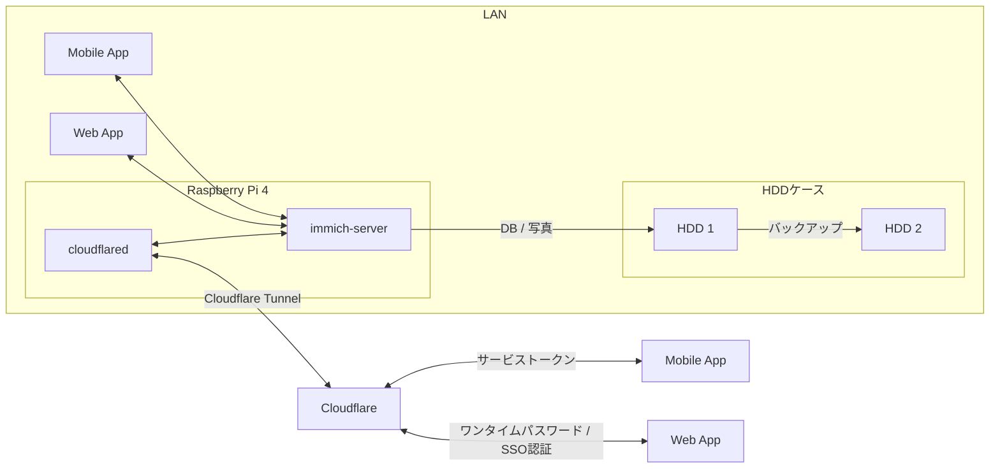
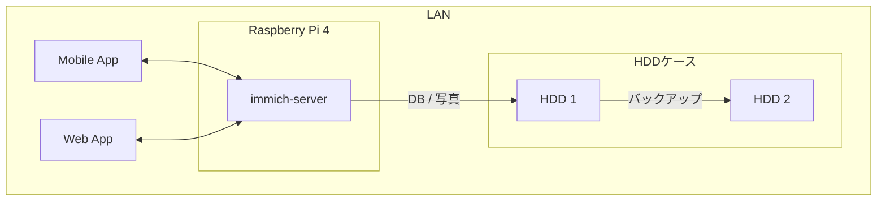
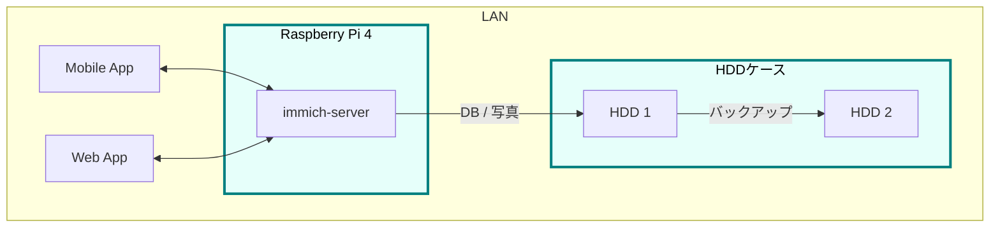
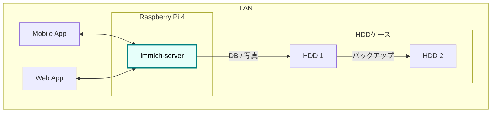
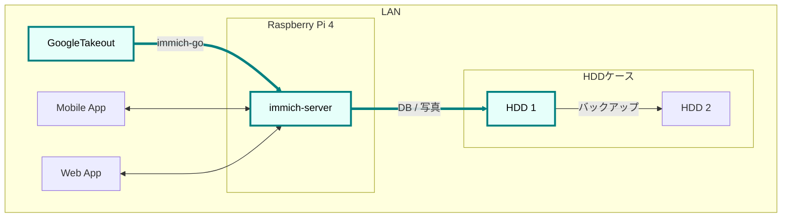
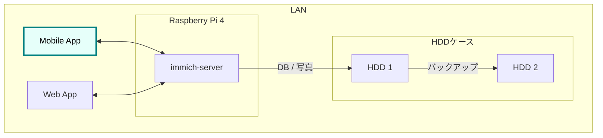
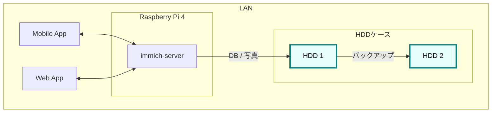
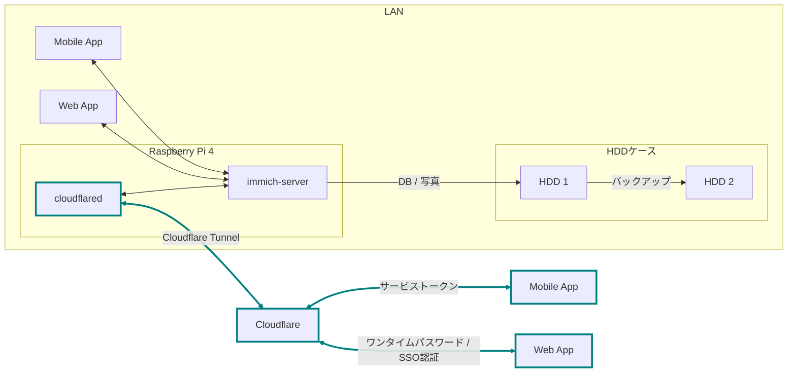
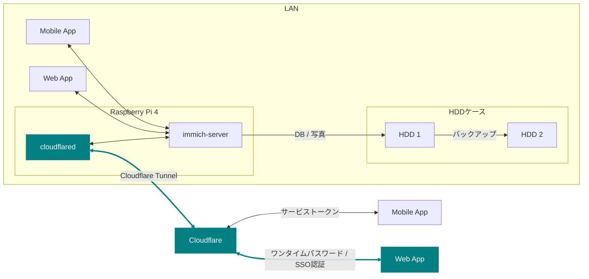
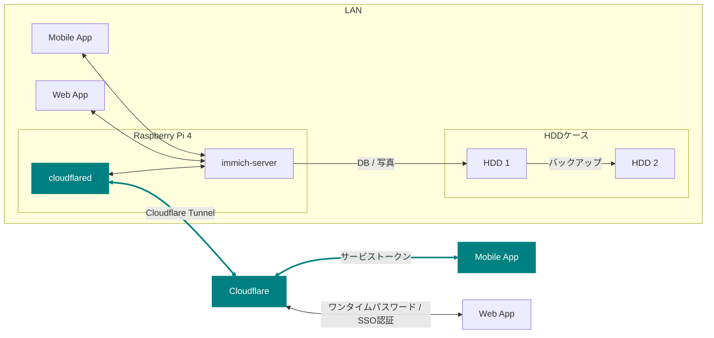

## はじめに


2024年6月から、自宅サーバを作って「おうちGoogleフォト」的な写真・動画管理環境を運用しています。
スマホで撮影した写真・動画をほぼ無制限にバックアップし、タイムライン・アルバムなどの機能で快適に閲覧できます。


遠方の両親には孫専用アルバムを共有しています。

運用開始から約1年、安定稼働しているので、構築手順やハマりどころなどを振り返ってみます。

## モチベーション

2024年前半に第一子が生まれ、写真・動画が一気に増えました。
それまで Google フォト のフリープランで運用していましたが[無制限が終了](https://www.itmedia.co.jp/news/articles/2011/12/news057.html)したことで容量が 16GB ほどに制限されてしまいおり、さすがに限界を迎えました。

_**この記事での「写真」は「写真と動画」 を意味しています。**_

息子の写真を撮るたびに容量が気になります...。長時間の動画も気にせず撮りたい...。容量問題は解決しなければならない課題でした。

この課題の達成条件は👇️の5つです

1.  事実上、無限に写真と動画が保存できること
2.  スマホから保存・閲覧できること
3.  サブスクはしないこと
4.  Google フォトに保存した大量のコンテンツを引き継げること
5.  息子の写真を、遠方の両親にラクにシェアできること
    - ラインで逐次送るのが面倒なので「このアプリのここをタップすれば孫の写真が見られるよ！」という状態にしたい

「サブスクしないこと」は写真を削除しない限り永続的に課金し続ける必要があるからです。私の現在（2025/08）の写真・動画データは合計265.6GBあります。

この量をサブスクで運用すると...

- [iCloud](https://www.apple.com/jp/icloud/) 2TB ¥1,500/月
- [Google](https://one.google.com/about/plans?hl=ja&g1_landing_page=0) 2TB ¥1,450/月
- [Amazonフォト](https://www.amazon.co.jp/b?ie=UTF8&node=5262648051) は動画が5GBまでなので却下
- [みてね](https://mitene.us/) は動画一本の長さが2分までに制限されるので却下

Googleでも年で ¥17,400 かかかりますし、それが永続的に続くと想像しながら暮らすのはストレスです。
個人的には、むしろHDDを買って手元で管理するほうが精神衛生的に良いです。

この記事では、

1.  容量無制限フォトストレージの構築（1.2.3.4.）
2.  遠隔地の写真をシェアする(5.)

という2つのゴールに分けて解説していきます。

## 完成図




上の図では、LAN 内の Immich サーバが Cloudflare を通じて外部公開される流れを示しています。モバイルアプリからはトークン、WebアプリからはSSO認証を通じてアクセスします。

<!--list-separator-->

- 登場人物
  1.  Immich: 写真・動画管理用のOSSアプリケーション
  2.  Raspberry Pi: Immichをホストするサーバ
  3.  HDD・ケース: DB,写真の保存領域
  4.  Cloudflare: LAN外との通信用のドメイン、トンネリング

## ゴール1: 容量無制限フォトストレージの構築

自宅内で写真の保存・閲覧を可能にするため、👇️の環境を構築します



### 必要なもの

写真管理用のアプリケーションとそれをホストするサーバ、そして保存領域が必要です。

#### アプリケーション

OSSのフォトアプリケーションはたくさんありますが、我が家はスマホでのみ写真を撮影するためモバイルアプリの存在が重要です。

👇️の比較表から見たときにモバイルアプリとアルバム機能がある **Immich** を採用しました。



これはGoogleフォトライクな写真・動画管理アプリです。別のツールを使用することでGoogle フォトからのデータ移行（後述）もサポートしています。

#### サーバ

サーバは Raspberry Pi 4 にしました。

メインの目的ではありませんが、クリアケースに入れて基盤が見えている無骨な姿にしたかったんですよね。
昔、ゲームボーイ や NINTENDO64 にあった[スケルトンモデル](https://www.nintendo.co.jp/n01/n64/hardware/clear.html)が好きでした...

ラズパイなら小さくて扱いやすいし、クリアケースもよく売っているので選びやすいのです。



OSのインストール用に必要


Immichの必須要件をクリアしている必要はあるので注意。



#### 保存領域

容量については物理HDDを2つ（1つはバックアップ用）用意。



玄人志向のスタンドに裸のHDDを立てて（いわゆる裸族）、クリアケースに入れたラズパイを隣においておく...
これもやりたかったんですよね...。

さて、必要なものが揃ったら次にラズパイをセットアップします

### ラズパイとHDDのセットアップ



#### OSのインストール

基本的には公式の手順に従います。OSを入れたSDカードをラズパイに指してbootする流れです。



#### ローカルIP固定化

ラズパイが起動したらローカルIPを固定します。今後ラズパイにログインしたり、自宅から Immich にアクセスしたりするとき、このIPを使うためです。DHCPによる自動割り当てだとIPが変わってしまうことがあるので、固定化しておきましょう。

ルータのDHCP設定画面で、 **ラズパイの有線LANのMACアドレス** と任意のIPアドレスを手動設定します。


画像の一番下の行で、ラズパイの有線LANのMACアドレスに対して任意のIPアドレスを紐づけています。
MACアドレスは以下の手順で調べられます

1.  ラズパイでコマンドラインを開く
2.  `ip a` を打ち込む
    ```sh
    ip a
    ```
3.  `eth0:` の `link/ether` の後に書いてある

wifiを使うなら `wlan0` を探すと良いですが、速度を考えると有線がおすすめです。

なお、使いたいIPアドレスが別の機器に設定されている場合、そのままでは手動割り当てできません。どうしても特定のIPアドレス（今回の例では 11.14）を使いたい場合は、以下の手順に従います。

1.  特定のIPアドレスを使用中の機器をネットワークから切断する
2.  ルータを再起動してIPアドレスの割り当てをリセットする
3.  手動設定する

家庭用ルータのDHCPサーバは「利用可能な番号から順に」割り当てることが多く、結果として若い番号から埋まっていく傾向があります（機種や設定で変わる）。そのため、若い番号を使いたい場合は、多くの機器を切断したうえでルータを再起動しなければならないと思われます。

また、『ラズパイ ip 固定』で検索すると、 `/etc/dhcpcd.conf` を編集したり `NetworkManager` を設定したりと様々な方法が紹介されています。しかし私の環境ではどれもうまくいかず...。最終的にはルータ側で設定することによって成功しました。ちなみにラズパイ公式も、この方法を推奨しているようです。

<!--list-separator-->

- とても参考になった記事

  

#### VNCやSSHによる遠隔操作

ラズパイのセットアップが終わったら、いちいちモニタに接続するのも面倒なので遠隔で操作できるようにしておきたいです。



また、sshしたときにパスワードを要求されるのも面倒なので、公開鍵認証できるようにしておくと楽ちん



#### ハードディスクのフォーマットとパーティション設定

次に、HDDケースにHDDを設置して、ラズパイとHDDケースをつなげます。


その後、以下を参考に2つのHDDをマウントします。


_私の場合、メインは `/mnt/hdd1` 、バックアップ用は `/mnt/hdd2` にマウントしました。_

ここまでで、ラズパイにOSを入れ、ローカルIPを固定し、HDDをマウントするところまで完了しました。
**次はいよいよ Immich の導入です。**

### Immichのセットアップ



#### Dockerでのセットアップと設定ファイルの用意

公式のクイックスタートと同じくDockerで立ち上げるのが楽です。


なお `.env` ファイルのうち写真アップロード先と・DB保存先は、先程マウントした `hdd1` にします。

```env
UPLOAD_LOCATION=/mnt/hdd1/immich/images
DB_DATA_LOCATION=/mnt/hdd1/immich/postgres
```

#### Immich管理アカウント作成

`docker compose up -d` によってコンテナ立ち上げが成功すると、 `http://<machine-ip-address>:2283` でImmichにアクセスできます。アクセス後はadminユーザの作成をします。


adminユーザなら一般ユーザアカウントも作成できるので、そのまま私・妻用のアカウントを作ってしまいます


また、ここでStorageTemplateの設定を確認しておくとよいです

#### StorageTemplate


これは写真や動画の保存先・フォルダ構造やファイル名の付け方を設定できる機能です。

私は `UPLOAD_LOCATION/library/ユーザ名/2022/2022-02-03/IMAGE_56437.jpg` のような形式で保存されるように設定しています。

この設定は、設定変更以降に追加した写真から反映されます。変更前に追加済であったものは、 `ジョブ → ストレージテンプレートの移行` ボタンを押すことで反映可能です。


私の場合、Google フォト から大量の写真を移動してきたあとに設定をしたので、反映にかなりの時間がかかりました。好みがあればあらかじめ設定しておくことをおすすめします。

ここまでで、ラズパイ・HDD・Immich のセットアップが完了しました。
次は Googleフォト にある写真・動画を Immich 経由でHDDに保存していきます。

### Googleフォトからの写真移行



`immich-go` を使います。Google フォトの 写真をImmichで管理する保存領域に移行できるコマンドラインツールです。

必要な材料は👇️です

1.  immich-go
2.  Google Takeout
    - Google アカウントに保存されているデータをエクスポートしたもの
3.  ユーザアカウントごとのImmich API キー
    - Immichに対してアプリケーション外から操作をする際に必要な鍵

具体的には、

```sh
./immich-go -server=http://<machine-ip-address>:2283 -key=<Immichで作成したAPI キー> upload -create-albums -google-photos <ダウンロードしたGoogle Photo Takeout のパス>
```

とコマンドを実行することで、Googleから落としてきたコンテンツをImmichの任意ユーザのコンテンツとして取り込むことが出来ます。

#### 写真の重複について

バックアップ前に“写真がどこにあるか”を整理しておく必要があります。過去のすべての写真がスマホに入っていれば Immich のモバイルアプリを起動して、スマホからバックアップするだけで済みます。
しかし実際には「Googleフォトだけにある写真」「スマホだけにある写真」「両方にある写真」が混在しています。

```ascii
// Google フォトに保存された写真と、スマホに保存された写真が一部重なってるイメージ
時系列:      2008 ------2017-------2023----------> 新しい

Googleフォト: [===========++++++++++]
スマホ       :           [++++++++++==========]
```

同じ写真がバックアップされてしまう容量がもったいないです。今回の方針では、2008〜2023年は Google フォトから移行し、それ以降はスマホから直接バックアップすることにしました。

厳密に分けることは難しく2024年前後に重複が発生しますが、Immich には重複検出・削除機能があるため、多少は許容範囲としています。


_Immichの重複検出・削除機能_

#### immich-go


では immich-go をダウンロードします。 `<> Code` 押下 &gt; `Download ZIP` でOK。


PC内の好きな場所においておきます

#### Google Takeout

Takeout は以下から出力できます。


Google フォトのみチェックボックスをONにして `次のステップ` を押下


次に `エクスポートを作成` を押下


しばらく待つとGoogleからメールが届きます


メールを開き、メール内リンクに飛ぶと、件数ごとにダウンロードボタンが設置されているので順次押下してダウンロードしていけばOKです。
zipファイルがダウンロードされるはず。


もし件数が多すぎて面倒であれば、エクスポート時のファイルサイズ設定を大きめにしましょう。

_私の場合は、自分と妻の2アカウント分をダウンロードしました。_

#### Immich API キー

お次に `API キー` を発行します。 `immich-go` から Immich のユーザアカウントに対して操作をする際に必要な鍵です。ユーザアカウント事に発行します。

手順

1.  Immichにログイン
2.  アカウント設定
3.  APIキー
4.  新しいAPIキー
5.  任意の名前をつけて作成押下
6.  新しいキーが発行されるのでコピーしておく


作成を押すとapiキーが表示されるのでコピーしておきましょう。

_こちらも私のアカウントと、妻のアカウントの2つ分を作成。_

#### immich-goによる移行

コマンドを実行する前に、 `Google Takeout` の zip を解凍して中身を確認します。今回は 2024年以降の写真はスマホからバックアップする方針のため、その期間を含む zip は不要です。

_例：Takeout が14分割で、11/14 以降の zip に 2024年のデータが含まれる場合は、11〜14を使用しませんのでどこかに移動しておきます。_

必要な zip ファイルを準備ができたら、 `immich-go` をダウンロードしたディレクトリへ移動して、次のコマンドを実行します。

```sh

./immich-go -server=http://<machine-ip-address>:2283 -key=<Immichで作成したAPI キー> upload -create-albums -google-photos /takeoutがあるディレクトリ名/takeout-*.zip

```

なお `--dry-run` オプションをつけることで、実行される処理を事前に確認できます。

コマンド実行後、しばらく待てば Immich に画像や動画が取り込まれているはずです。私のアカウントは写真が多かったのでコマンドを実行して寝ました🛌。翌朝には終わっていた記憶です。

_私と妻の2アカウント分実行しました_

### モバイルアプリの設定

次に Immich モバイルアプリをダウンロードしてセッティングしましょう。



ダウンロード・ログイン・バックアップ、すべて以下のドキュメントに従えばOKです👍️


アプリ起動直後は、 `http://<machine-ip-address>:2283` を打ち込みます。


その後、作成したユーザのメールアドレスとパスワードを打ち込めばログイン完了！


次にスマホのローカルに入っている写真・動画のバックアップ設定を行います。


自動バックアップ設定もしておくと良い


これで、スマホで取った写真をImmich経由でHDDに保存し、そのまま閲覧できるようになります。


### HDD1をバックアップする

最後にHDD1のデータをHDD2にも保存しておきたいです。HDD1がだめになったらすべての資産が消えてしまうので



HDD1からHDD2へのバックアップには、 `Borg` を使います。差分バックアップツールです。



Immich公式でも `borg` によるバックアップ方法がドキュメントとして整備されているため採用。


手順は公式ドキュメントに従えばOK。ドキュメント中の “Borg backup template” をベースにしたスクリプトを immich-borg.sh として保存し、毎週土曜の午前1:00に実行されるよう crontab を設定しています。

```cron
0 1 * * 6 /immich-borg.sh
```

### Done

これで、スマホから Immich にログインし、撮影した写真や動画をそのまま HDD にバックアップできる環境が整いました。
当初掲げていた条件もすべてクリアしています。

当初の条件もクリアです

- [x] 1. 事実上、無限に写真と動画が保存できること
  - HDDの容量を大きいものに変更すればいいので
- [x] 2. スマホから保存・閲覧できること
- [x] 3. サブスクはしないこと
- [x] 4. Google フォトに保存した大量のコンテンツを引き継げること

週に一度は別のHDDにもバックアップを行うことで、データの冗長性も確保[^fn:1]しています。

加えて Immich のアルバム機能を使えば、「息子用アルバム」や「旅行用アルバム」を作成し、私と妻がそれぞれ写真を追加できます。これまで Google フォトや [LINE](<https://en.wikipedia.org/wiki/Line_(software)>) で行っていた共有のスタイルも、そのまま実現できています。

これにて

- [x] ゴール1: 容量無制限フォトストレージの構築

はクリアです

## ゴール2: 遠隔地の家族に安全に写真をシェアする

さて、これで夫婦間の写真管理は解決しました。しかし次の課題は **両親への共有** です。
これまで私と妻は、それぞれの両親に[LINE](<https://en.wikipedia.org/wiki/Line_(software)>)で写真を送っていました。これがかなり面倒...😇
『一箇所にまとめておけば、好きなときに見てもらえる仕組み』がどうしても欲しいです。

幸いImmichであれば複数アカウントが作成できます。アルバム機能もありますし、アルバム事に権限の管理もできます。そのため、親用のアカウントを作り、特定のアルバムに閲覧権限を付与すればよいです。両親はアプリを開いてアルバムをタップすれば、愛孫のかわいい〜👶写真を眺めることができます。


しかし、自宅ホストのサーバである以上、外部（遠方の両親）からの **安全なアクセス手段** が必要です。

この課題を解決するために、 `Cloudflare Tunnel` を用います。

### Cloudflare Tunnel × Cloudflare Access

Cloudflare Tunnel は、軽量ツール（ cloudflared ）をサーバに入れるだけで、公開IPやポート開放なしに外部公開できる仕組みです。通信はすべてCloudflare経由になるので安全に扱えます。


実際、2023年6月ごろに Immich公式Discord でも「どうやってインターネットに公開するのがよいか？」という議論があり、一定数のユーザーが Cloudflare Tunnel を採用しているようです。


なお注意点として Cloudflare Tunnel にはアップロード制限があります。100MB以上のファイルをアップロードする際には注意が必要です（今回は閲覧オンリーなので問題はなし）

また、 `Cloudflare Access` による認証を組み合わせれば限定公開も容易です。

それではセットアップしていきます

### 完成図（Cloudflare）



### Cloudflare Registoryでドメインを取得する

Cloudflareにサインアップし、[ダッシュボード](https://dash.cloudflare.com/login)から `ドメインの登録 > ドメイン登録` に遷移して任意のドメインを取得します

### tunnelの作成

ドメインの購入が完了したらトンネルを作成します。

手順

1.  `ダッシュボード`
2.  `サイドメニュー`
3.  `Zero Trust`
4.  `ネットワーク`
5.  `Tunnels`
6.  `トンネルを作成する`


1.  `Cloudflaredを選択する`
2.  `任意の名前をつけて保存`
3.  `次へ`


次に、 `Debian` を選択して、表示されるコマンドをサーバで実行しましょう。


サーバ側でのコマンドが成功すると、このようにコネクタIDと接続済みステータスが表示されるので次へ押下


以下を入力して保存を押下

- サブドメイン: 任意の名前
- ドメイン: Cloudflareで購入したドメインがプルダウンで表示されるため選択
- サービス: HTTP
- URL: localhost:2283


これで、自宅サーバをCloudflare経由で外部公開可能となりました。設定したURLを打ち込むことで、アクセス可能となっているはずです。

### Cloudflare Accessで認証機能を追加する

しかし、このままだとアクセス制限がついてなくて危険です。特定の人物しかアクセスできないように設定していきます。

#### Webブラウザからの認証



まずはLAN外からブラウザで Immich へアクセスしたときに、Email認証ができるようにを設定します。

ポリシーの追加画面に移動します

1.  `Access`
2.  `ポリシー`
3.  `ポリシーを追加する`


お次にポリシーを設定

1.  ポリシー名に任意の名前を設定
2.  セレクターで Emails を選択
3.  認証時にSSO対象となるメールアドレスを追加する
4.  保存


以下のように追加されます


続いて、作成したポリシーをアプリケーションに設定します。

1.  `Access`
2.  `アプリケーション`
3.  `アプリケーションを追加する`


次にアプリケーションの種類を選びます

1.  `セルフホスト`
2.  `選択する`


アプリケーションの情報を入力します

1.  任意のアプリケーション名を追加
2.  パブリックホスト名を追加をクリック &gt; パブリックホストの入力欄が出てくる
3.  サブドメイン・ドメインは先程のTunnelと同様のものを入力
4.  Access ポリシー欄で、 `既存のポリシーを選択` を押下


1.  先ほど作成したポリシーがでてくるのでチェックして確認
2.  次へ で進んでいくと、保存ボタンが出てくるので保存します


以上です。
再び、設定したURLにブラウザでアクセスしてみると、SSO認証画面が表示されるはずです


ここでポリシーに追加した Email を入力すればメールが届き、メールに書いてあるパスコードを入力することで認証を突破できます。突破後はImmichのログイン画面に遷移します。
（画像ではGoogle のOAuthでも認証できるようにしています）


ブラウザから利用する場合は以上です。実家に帰ったとき、PCをTVにつなげて大画面で孫の画像を見ることがあるので、この設定は必須です

#### モバイルアプリからの認証



次に、Immichモバイルアプリからアクセスする方法です。モバイルアプリではブラウザのように認証画面に遷移できないので、そのままではログインできません。そこで Cloudflareの `Service Token` と、Immichモバイルアプリの設定 `カスタムプロキシヘッダ設定` を活用します。

`Service Token` は、アプリやプログラムから Cloudflare の制限されたリソースへとアクセスするための鍵です。

Immich モバイルアプリには、サーバへアクセスする際のリクエストに任意の値を含めることができる `カスタムプロキシヘッダ` 設定があります。こちらにトークンを設定することで、認証を突破できるという寸法です。

#### Cloudflare上の設定

では、さっそく Service Token を作成していきましょう

1.  `Cloudflare Zero Trustホーム`
2.  `Access`
3.  `サービス認証`
4.  `サービストークンを作成する`


1.  任意のトークン名を入力
2.  任意の期限を入力
3.  トークンを生成する


すると、以下のように `クライアントID` と `クライアントシークレット` が表示されるのでコピーしておきます。


お次は再びポリシーを作成します

次に、再びポリシーを作成します。セレクターから Service Token を選び、先ほど作成したトークンをプルダウンから選択します。


ポリシーを保存し、先ほど作成したアプリケーションにこのポリシーを設定します

1.  `Access`
2.  `アプリケーション`
3.  作成したアプリケーション名の三点ドット
4.  `編集`


アプリケーションにポリシーを追加します

1.  `タグ: ポリシー`
2.  `既存のポリシーを選択`
3.  作成した Service Tokenのポリシーを選択
4.  `確認`
5.  `アプリケーションを保存`


これでCloudflare側の設定は完了です。

#### Immich モバイルアプリ上の設定

お次はImmichのモバイルアプリで、アクセス時にトークンを含めるように設定します。

1.  Immichモバイルアプリのログイン画面を開く
2.  歯車マークをタップ
3.  カスタムプロキシヘッダをタップ
4.  プロキシヘッダに以下を入力します
    1.  生成したクライアントIDのヘッダーと値
    2.  クライアントシークレットのヘッダーと値


設定は以上です👍️
これで、Immichモバイルアプリから外部向けURLにアクセスしても認証を通過でき、作成済みアカウントでログインすれば写真を閲覧できます。


つまり、以下の手順を4人分実施すれば良いわけです。

1.  Immichで両親のアカウントを作成する
2.  両親のアカウントに、息子のアルバムへの閲覧権限を付与する
3.  両親のスマホにモバイルアプリをダウンロードする
4.  モバイルアプリでカスタムプロキシヘッダを設定
5.  各自のアカウントでログイン

これで、両親は自分のアカウントでログインし、アルバムをタップするだけで、いつでも孫の写真を見られるようになりました

### Done👍️

これにて、

- [x] 遠隔地の家族に安全に写真をシェアする

クリアです。

## 最後に

今回の構築で、

1.  事実上、無限に写真と動画が保存できること
2.  スマホから保存・閲覧できること
3.  サブスクはしないこと
4.  Google フォトに保存した大量のコンテンツを引き継げること
5.  息子の写真を、遠方の両親にラクにシェアできること

といった条件をすべて満たすことができました。

費用とメリデメを振り返ってみます

#### 費用

| 項目                  | 単価    | 数量 | 小計    |
| --------------------- | ------- | ---- | ------- |
| Raspberry Pi 4 (8GB)  | ¥12,000 | 1    | ¥12,000 |
| HDD 1TB               | ¥7,000  | 2    | ¥14,000 |
| HDDケース（スタンド） | ¥4,000  | 1    | ¥4,000  |
| 雑費（SD・ケーブル）  | ¥600    | 1    | ¥600    |
| 合計                  |         |      | ¥30,600 |

| 項目       | 単価   | 数量 | 小計   |
| ---------- | ------ | ---- | ------ |
| ドメイン代 | ¥1,000 | 1    | ¥1,000 |
| 年額合計   |        |      | ¥1,000 |

Google One (2TB) は ¥17,400/年。
初期費用はかかるものの、2年弱運用できればおとく...?!

#### メリデメ

メリット

- サブスク費用が不要（HDD増設すれば容量は実質無限）
- エンジニアとしての勉強になる

デメリット

- 初期構築の手間（Docker, Cloudflare などの理解が必要）
- HDDが壊れたときのリスクが大きい。クラウドと比べてリスク分散も難しい
- Immich のアップデート時、破壊的な変更がたまにあるため、しっかり調べて対応しなければならない

あれ...あんまりメリットがない...?🧐

エンジニアの勉強・趣味としてはとても良いですが、とにかくたくさん写真・動画を保存したいならサブスクするのが早いですね。

#### 今後の課題

- もう一箇所バックアップを用意したい
- 週1のバックアップ用にもかかわらず、HDD2が常時接続＆回転しっぱなし。
  - 必要な時間だけ起動・それ以外はスリープできるようにできないか
- iPhoneでImmichを開くと最初に1分ほどフリーズする
  - おそらくスマホのローカルに入っている写真が多すぎるため、「バックアップ済みかどうかの確認」に時間がかかっている可能性がある
  - 余裕があれば調査したい

[^fn:1]: [3-2-1 backup strategy](https://www.backblaze.com/blog/the-3-2-1-backup-strategy/) に従うと、別の場所にもう1つバックアップを用意すべきでしょうね。
