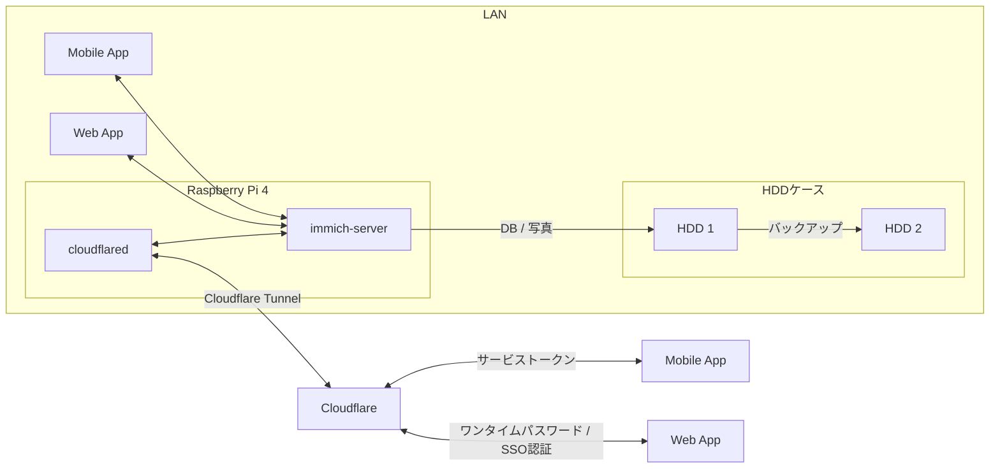
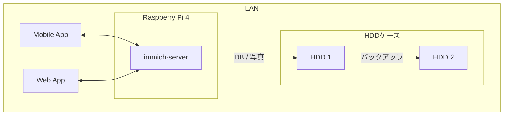
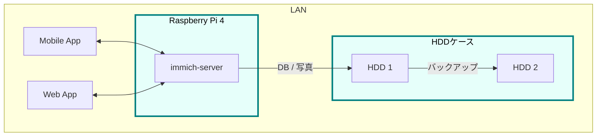
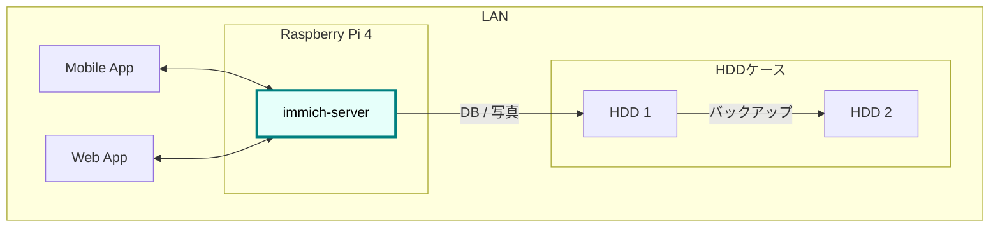
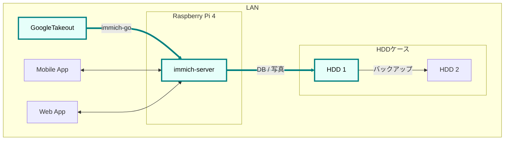
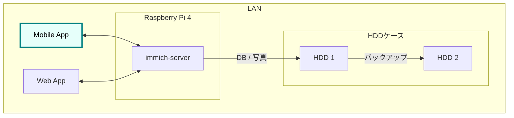
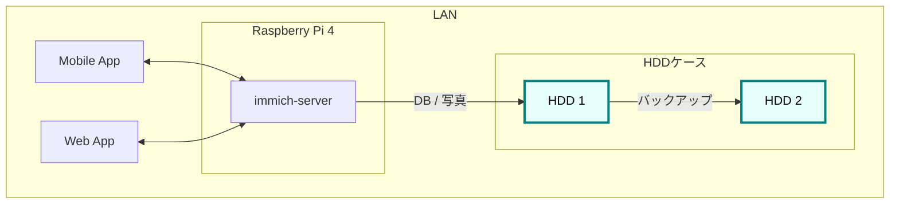
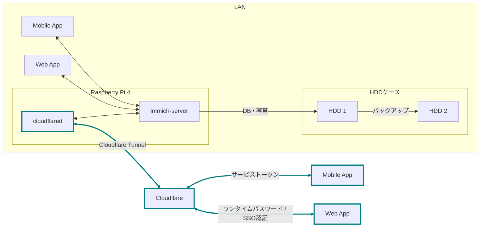
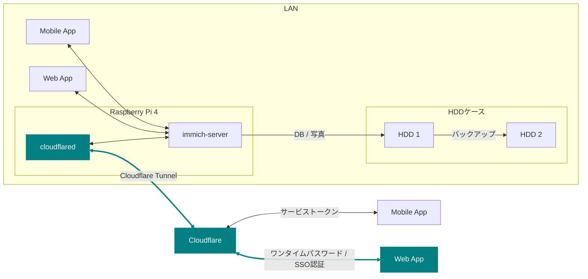
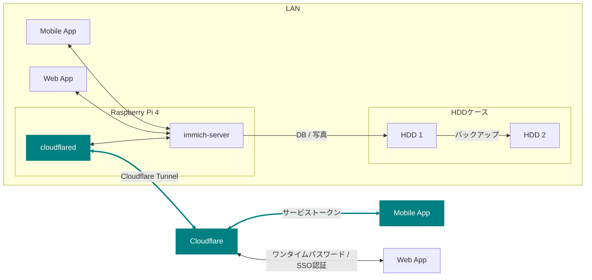

:::note
まだmermaid記法に未対応のため、コードのまま掲載しています
:::


2024年6月から自宅サーバで「おうちGoogleフォト」を運用している。
スマホで撮影した写真・動画を事実上無制限に保存して快適に閲覧ができる。


遠方の両親にはアルバムを共有。モバイルアプリがあるのでスマホから見てもらえる。

運用開始から約1年、安定稼働しているため、構築手順やハマりどころなどを振り返っておく。

## モチベ

2024年に第一子が生まれ、写真・動画が一気に増えた。
それまで Google フォト のフリープランで運用していたが、無制限が終了したことで容量が 16GB ほどに制限されており、さすがに限界を迎えた。  
[Googleフォトの容量無制限無料バックアップ、2021年5月末で終了](https://www.itmedia.co.jp/news/articles/2011/12/news057.html)

容量を気にせずバンバン撮りたいので、👇の目標を立てた。

1. 事実上、無限に保存できること
2. スマホから保存・閲覧できること
3. サブスクしないこと
4. Google フォトからデータ移行できること
5. 遠方の両親にもシェアできること

現在（2025/08）のデータは合計265.6GBあるため、もしサブスクで運用すると...

- [iCloud](https://www.apple.com/jp/icloud/) 2TB ¥1,500/月
- [Google](https://one.google.com/about/plans?hl=ja&g1_landing_page=0) 2TB ¥1,450/月
- [Amazonフォト](https://www.amazon.co.jp/b?ie=UTF8&node=5262648051) は動画が5GBまでなので却下
- [みてね](https://mitene.us/) は動画一本の長さが2分までに制限されるようなので却下

Googleでも ¥17,400/年 かかる模様

この記事では、

1.  フォトストレージの構築（1.2.3.4.）
2.  遠隔地の写真をシェアする(5.)

という2つのゴールに分けて解説。

## 完成図



LAN 内の Immich サーバが Cloudflare を通じて外部公開される様子。モバイルアプリからはトークン、WebアプリからはSSO認証を通じてアクセスする。

- 登場人物
  1.  Immich: 写真・動画管理用のOSSアプリケーション
  2.  Raspberry Pi: Immichをホストするサーバ
  3.  HDD・ケース: DB,写真の保存領域
  4.  Cloudflare: LAN外との通信用のドメイン、トンネリング

## ゴール1: フォトストレージの構築



### 必要なもの

写真管理用のアプリケーションとそれをホストするサーバ、そして保存領域。

#### アプリケーション

OSSのフォトアプリケーションはたくさんある。我が家はスマホだけで写真を撮るのでモバイルアプリが必須。

👇️の比較表から見たときにモバイルアプリとアルバム機能がある [Immich](https://immich.app/) を採用。Googleフォトライクなアプリで、別のツールを使用することでGoogle フォトからのデータ移行（後述）もサポートしている。

#### サーバ

Raspberry Pi 4 にした。好みです。アクセサリとともに。  
- [ラズベリーパイ 4 コンピューターモデルB 8GB](https://amzn.to/4fJMDiX)  
- [Miuzei 最新 Raspberry Pi 4 ケース](https://amzn.to/4mJ9zBl)  
- [KIOXIA(キオクシア) 旧東芝メモリ microSD 64GB](https://amzn.to/46Zbo8y)    
SDはOSのインストール用に必要

Immichの [必須要件](https://immich.app/docs/install/requirements/) をクリアしている必要はあるので注意。

#### 保存領域

容量については物理HDDを2つ（1つはバックアップ用）用意。  
- [WESTERN DIGITAL 3.5インチ内蔵HDD](https://amzn.to/4fTmU7W)  
- [LHR-2BDPU3ES](https://amzn.to/4fFb29p)  

HDDを裸て使ってみたかった

さて、必要なものが揃ったら次にラズパイをセットアップします

### ラズパイとHDDのセットアップ



#### OSのインストール

公式に従います。OSを入れたSDカードをラズパイに指してbootする。  
[Getting started - Raspberry Pi Documentation](https://www.raspberrypi.com/documentation/computers/getting-started.html#sd-cards)

#### ローカルIP固定化

ラズパイが起動したらローカルIPを固定する。DHCPによる自動割り当てでIPが変わってしまうので、固定化しておくと楽。


ルータのDHCP設定で、ラズパイの有線LANのMACアドレスに対して任意のIPアドレスを紐づけている（画像の一番下の行）。
MACアドレスは以下で調べる。

1.  ラズパイでをシェルを開く
2.  `ip a`{lang="bash"} を実行する
3.  `eth0:`{lang="bash"} の `link/ether`{lang="bash"} の後に書いてある

wifiを使うなら `wlan0`{lang="bash"} を探すと良いが、速度を考えると有線がいいでしょう（今回は画像系なので特に）。

なお、使いたいIPアドレスが別の機器に設定されている場合、そのままでは手動割り当てができない。どうしても特定のIPアドレス（今回の例では 11.14）を使いたい場合は、以下の手順に従う。

1.  使いたいIPアドレスを使っている機器を、ネットワークから切断
2.  ルータを再起動してIPアドレスの割り当てをリセット
3.  手動設定

一般的に利用可能な番号から順に割り当てることが多く、結果として若い番号から埋まっていく傾向がある模様（機種や設定で変わる）。

また、『ラズパイ ip 固定』で検索すると、 `/etc/dhcpcd.conf` を編集したり `NetworkManager` を設定するような記事がでてくるが、私の環境ではどれもうまくいかず...。ラズパイ公式も、ルーターでアドレス指定してねと言っている。  
[Assign a static IP address](https://www.raspberrypi.com/documentation/computers/configuration.html#assign-a-static-ip-address)

#### VNCやSSHによる遠隔操作

ラズパイのセットアップが終わったら、毎度モニタにつなぐのも面倒なので遠隔でリモートデスクトップできるようにする。  
[VNCでRaspberry Piにリモートデスクトップ接続](https://www.indoorcorgielec.com/resources/raspberry-pi/raspberry-pi-vnc/)    

sshしたときにパスワードを打つのも面倒なので、公開鍵認証しておくと楽ちん  
[ラズベリーパイをリモート操作（SSHコマンド）](https://raspi-school.com/ssh/)    

#### ハードディスクのフォーマットとパーティション設定

次に、HDDケースにHDDを設置して、ラズパイとHDDケースをつなげる。


その後、以下を参考に2つのHDDをマウント。  
[Raspberry PiでHDDをマウントする](https://qiita.com/shimanuki-yu/items/cddf7e1d490ad66743f3)

_私の場合、メインは `/mnt/hdd1` 、バックアップ用は `/mnt/hdd2` にマウントした。

これで、ラズパイにOSを入れ、ローカルIPを固定し、HDDをマウントできた。次はImmichの導入。

### Immichのセットアップ



#### Dockerでのセットアップと設定ファイルの用意

[公式のクイックスタート](https://immich.app/docs/overview/quick-start)と同じくDockerで立ち上げるのが楽。

なお `.env` ファイルのうち写真アップロード先とDB保存先は、先程マウントした `hdd1` にしておく。

```env
UPLOAD_LOCATION=/mnt/hdd1/immich/images
DB_DATA_LOCATION=/mnt/hdd1/immich/postgres
```

#### Immich管理アカウント作成

コンテナ立ち上げが成功すると、 `http://<machine-ip-address>:2283` でImmichにアクセスできる。アクセス後は[adminユーザの作成](https://immich.app/docs/administration/user-management#register-the-admin-user)をする


一般ユーザアカウントも作成できるので、そのまま私・妻用のアカウントを作った。

また、ここでStorageTemplateの設定を確認しておくといい👇️

#### [StorageTemplate](https://immich.app/docs/administration/storage-template/)

写真や動画の保存先・フォルダ構造やファイル名の付け方の設定のこと。私は `UPLOAD_LOCATION/library/ユーザ名/2022/2022-02-03/IMAGE_56437.jpg` のような形式で保存されるようにしている。

設定変更以降に追加した写真から反映され、変更前に追加済であったものは、 `ジョブ → ストレージテンプレートの移行` ボタンを押すことで反映可能。


私の場合、Google フォト から大量の写真を移動してきたあとに設定をしたため、反映にかなりの時間がかかった。好みがあれば予め設定しておけると嬉しい。

ここまでで、ラズパイ・HDD・Immich のセットアップが完了。次は Googleフォト にある写真・動画を Immich に移行する。

### Googleフォトからの移行


`immich-go` を使う。Google フォトの 写真をImmichで管理する保存領域に移行できるコマンドラインツールです。

必要な材料👇️

1.  immich-go
2.  Google Takeout
    - Google アカウントに保存されているデータをエクスポートしたもの
3.  ユーザアカウントごとのImmich API キー
    - Immichに対してアプリケーション外から操作をする際に必要な鍵

具体的には、

```sh
./immich-go -server=http://<machine-ip-address>:2283 -key=<Immichで作成したAPI キー> upload -create-albums -google-photos <ダウンロードしたGoogle Photo Takeout のパス>
```

とすることで、Googleから落としてきたコンテンツをImmichの任意ユーザのコンテンツとして取り込むことができる。

#### 写真の重複

バックアップ前に“写真がどこにあるか”を整理しておく必要がある。過去のすべての写真がスマホに入っていれば Immich のモバイルアプリを起動して、スマホからバックアップするだけでOK。

しかし実際には「Googleフォトだけにある写真」「スマホだけにある写真」「両方にある写真」が混在している。

```ascii
// Google フォトに保存された写真と、スマホに保存された写真が一部重なってるイメージ
時系列:      2008 ------2017-------2023----------> 新しい

Googleフォト: [===========++++++++++]
スマホ       :           [++++++++++==========]
```
同じ写真がバックアップされてしまうと、容量がもったいない。

今回は、2008〜2023年は Google フォトから移行し、それ以降はスマホから直接バックアップすることにした。

厳密に分けることは難しく2024年前後に重複が発生するが、Immich には重複検出・削除機能があるため、多少は許容範囲。


#### [immich-go](https://github.com/simulot/immich-go)
immich-go をダウンロードする。 `<> Code` 押下 &gt; `Download ZIP` でOK。


PC内の好きな場所においておく。

#### Google Takeout

以下のリンクから Google Takeout にアクセスして、エクスポートする。
https://takeout.google.com/

Google フォトのみチェックボックスをONにして `次のステップ` を押下


`エクスポートを作成` を押下


しばらく待つとGoogleからメールが届く


メール内リンクに飛ぶと、件数ごとにダウンロードボタンが設置されている。順次押下してダウンロードしていけばOK。zipファイルがダウンロードされるはず。


件数が多すぎて面倒であれば、エクスポート前にファイルサイズを大きめに設定しておくといい。

#### Immich API キー

お次に `API キー` を発行する。`immich-go` から Immich のユーザアカウントに対して操作する際に必要な鍵。ユーザアカウント事に発行する。

手順

1. Immichにログイン
2. アカウント設定
3. APIキー
4. 新しいAPIキー
5. 任意の名前をつけて作成押下
6. 新しいキーが発行されるのでコピーしておく


#### immich-goで移行

コマンドを実行する前に、`Google Takeout` の zip を解凍して中身を確認する。今回は 2024年以降の写真はスマホからバックアップする方針のため、その期間を含む zip は不要。使用しないファイルはどこかに移動しておく

必要な zip ファイルを準備ができたら、 `immich-go` をダウンロードしたディレクトリへ移動して、次のコマンドを実行。

```sh
./immich-go -server=http://<machine-ip-address>:2283 -key=<Immichで作成したAPI キー> upload -create-albums -google-photos /takeoutがあるディレクトリ名/takeout-*.zip
```
なお `--dry-run` オプションをつけることで、実行される処理を事前に確認できる。

コマンド実行後、しばらく待てば Immich に画像や動画が取り込まれている。私のアカウントは写真が多かったためコマンドを実行して寝た🛌。翌朝には終わっていた。

### モバイルアプリの設定

次に Immich モバイルアプリをダウンロードしてセッティング。



ダウンロード・ログイン・バックアップ、すべて以下のドキュメントに従えば無問題️  
https://immich.app/docs/features/mobile-app/

アプリ起動直後は、 `http://<machine-ip-address>:2283` でアクセス


作成したユーザのメールアドレスとパスワードを打ち込めばログイン可能


次にスマホのローカルに入っている写真・動画のバックアップ設定を行う  
https://immich.app/docs/features/mobile-app/#backup

自動バックアップ設定もしておくと良い  
https://immich.app/docs/features/automatic-backup

これで、スマホで取った写真をImmich経由でHDDに保存し、そのまま閲覧できるようになる。


### HDD1をバックアップする

最後にHDD1のデータをHDD2にバックアップするよう設定したい。HDD1がだめになったらすべての資産が消えてしまうので



[Borg](https://www.borgbackup.org) を使う。差分バックアップツール。
Immich公式でも `borg` による[バックアップ方法](https://immich.app/docs/guides/template-backup-script/)が紹介されているため採用。

手順は公式ドキュメントに従う。ドキュメント中の “Borg backup template” をベースにしたスクリプトを`immich-borg.sh`として保存し、毎週土曜の午前1:00に実行されるよう`crontab`を設定。

```cron
0 1 * * 6 /immich-borg.sh
```

### Done

これで、スマホから Immich にログインして、撮影した写真や動画をそのまま HDD にバックアップできる環境が整った。
当初の条件もクリア

- [x] 1. 事実上、無限に写真と動画が保存できること
- [x] 2. スマホから保存・閲覧できること
- [x] 3. サブスクはしないこと
- [x] 4. Google フォトに保存した大量のコンテンツを引き継げること

週に一度は別のHDDにもバックアップを行う[^fn:1]。

加えて Immich のアルバム機能を使えば、「息子用アルバム」や「旅行用アルバム」を作成し、私と妻がそれぞれ写真を追加できる。これまで Google フォトや LINE で行っていたスタイルも実現できる。

これにて、フォトストレージの構築はクリア。家庭内の写真管理は解決した。

## ゴール2: 遠隔地の家族に安全に写真をシェアする

次の課題は両親への共有。  
いままで私は LINE で親に写真を送っていた。が、結構面倒...😇
『一箇所にまとめておけば、好きなときに見てもらえる仕組み』がほしい。

幸いImmichであれば複数アカウントが作成できる。アルバム機能もあり、アルバム事に権限管理も可。
親用のアカウントを作り、両親はアプリを開いてアルバムをタップすれば、愛孫のかわいい〜👶写真を眺めることができるのでは🤔


しかし、自宅ホストのサーバである以上、外部からの安全なアクセス手段が必要。

この課題を解決するために、 `Cloudflare Tunnel` を使う。

### Cloudflare Tunnel × Cloudflare Access

[Cloudflare Tunnel](https://developers.cloudflare.com/cloudflare-one/connections/connect-networks/)は、軽量ツール（`cloudflared`）をサーバに入れることで公開IPやポート開放なしに外部公開できるもの。通信はCloudflareを経由する。

2023年6月ごろに [Immich公式Discord](https://discord.com/channels/979116623879368755/1122615710846308484) に「どうやってインターネットに公開するのがよいか？」という議論があり、一定数のユーザーが Cloudflare Tunnel を採用していると述べている。

更に、`Cloudflare Access` による認証を組み合わせれば限定公開も容易。

なお、100MB以上のファイルをアップロードする際には制限があるので注意が必要（今回は読み込みオンリーなので問題はなし）

### 完成図（Cloudflare）



### Cloudflare Registry でドメインを取得する

Cloudflareにサインアップし、[ダッシュボード](https://dash.cloudflare.com/login)から `ドメインの登録 > ドメイン登録` に遷移して任意のドメインを取得。
（取得しなくてもいい）

### tunnelの作成

ドメインの購入が完了したらトンネルを作成。

#### 手順
1.  `ダッシュボード`
2.  `サイドメニュー`
3.  `Zero Trust`
4.  `ネットワーク`
5.  `Tunnels`
6.  `トンネルを作成する`


1.  `Cloudflaredを選択する`
2.  `任意の名前をつけて保存`
3.  `次へ`


`Debian` を選択して、表示されるコマンドをサーバで実行。


サーバ側でのコマンドが成功すると、このようにコネクタIDと接続済みステータスが表示されるので次へ押下


以下を入力して保存を押下

- サブドメイン: 任意の名前
- ドメイン: Cloudflareで購入したドメインがプルダウンで表示されるため選択
- サービス: HTTP
- URL: localhost:2283


これで、Cloudflare経由で外部公開できた。設定したURLを打ち込むことで、アクセス可能となっているはず。

### Cloudflare Accessで認証機能を追加する

しかし、アクセス制限がついてなくて危険なので設定していく。

#### Webブラウザからの認証



まずはLAN外からブラウザで Immich へアクセスしたときに、Email認証ができるようにを設定。

ポリシーの追加画面に移動

1.  `Access`
2.  `ポリシー`
3.  `ポリシーを追加する`


お次にポリシーを設定

1.  ポリシー名に任意の名前を設定
2.  セレクターで Emails を選択
3.  認証時にSSO対象となるメールアドレスを追加する
4.  保存


以下のように追加される


続いて、作成したポリシーをアプリケーションに設定する。

1.  `Access`
2.  `アプリケーション`
3.  `アプリケーションを追加する`


次にアプリケーションの種類を選ぶ

1.  `セルフホスト`
2.  `選択する`


アプリケーションの情報を入力

1.  任意のアプリケーション名を追加
2.  パブリックホスト名を追加をクリック &gt; パブリックホストの入力欄が出てくる
3.  サブドメイン・ドメインは先程のTunnelと同様のものを入力
4.  Access ポリシー欄で、 `既存のポリシーを選択` を押下


1.  先ほど作成したポリシーがでてくるのでチェックして確認
2.  次へ で進んでいくと、保存ボタンが出てくるので保存


以上。再び、設定したURLにブラウザでアクセスしてみると、SSO認証画面が表示されるはず


ポリシーに追加した Email を入力すればメールが届き、メールに書いてあるパスコードを入力することで認証を突破できる。突破後はImmichのログイン画面に遷移する。（画像ではGoogle のOAuthでも認証できるようにしている）


#### モバイルアプリからの認証



次に、Immichモバイルアプリからアクセスする方法。モバイルアプリではブラウザのように認証画面に遷移できないため、そのままではログインできない。

そこで Cloudflareの `Service Token` と、Immichモバイルアプリの設定 `カスタムプロキシヘッダ設定` を活用する。

`Service Token` は、アプリやプログラムから Cloudflare の制限されたリソースへとアクセスするための鍵。

Immich モバイルアプリには、サーバへアクセスする際のリクエストに任意の値を含めることができる `カスタムプロキシヘッダ` 設定があるため、こちらにトークンを設定することで認証を突破できる。

#### Cloudflare上の設定

Service Token を作成する

1.  `Cloudflare Zero Trustホーム`
2.  `Access`
3.  `サービス認証`
4.  `サービストークンを作成する`


1.  任意のトークン名を入力
2.  任意の期限を入力
3.  トークンを生成する


`クライアントID` と `クライアントシークレット` が表示されるのでコピーしておく。


次に、再びポリシーを作成。セレクターから Service Token を選び、先ほど作成したトークンをプルダウンから選択。


ポリシーを保存し、先ほど作成したアプリケーションにこのポリシーを設定。

1.  `Access`
2.  `アプリケーション`
3.  作成したアプリケーション名の三点ドット
4.  `編集`


アプリケーションにポリシーを追加

1.  `タグ: ポリシー`
2.  `既存のポリシーを選択`
3.  作成した Service Tokenのポリシーを選択
4.  `確認`
5.  `アプリケーションを保存`


これでCloudflare側の設定は完了。

#### Immich モバイルアプリ上の設定

お次はImmichのモバイルアプリで、アクセス時にトークンを含めるように設定する。

1.  Immichモバイルアプリのログイン画面を開く
2.  歯車マークをタップ
3.  カスタムプロキシヘッダをタップ
4.  プロキシヘッダに以下を入力します
    1.  生成したクライアントIDのヘッダーと値
    2.  クライアントシークレットのヘッダーと値


以上。これで、Immichモバイルアプリから外部向けURLにアクセスしても認証を通過でき、作成済みアカウントでログインすれば写真を閲覧できる。


つまり、以下の手順を4人分実施すれば、両親も自分のスマホから孫の写真を見られるようになる。

1.  Immichで両親のアカウントを作成する
2.  両親のアカウントに、息子のアルバムへの閲覧権限を付与する
3.  両親のスマホにモバイルアプリをダウンロードする
4.  モバイルアプリでカスタムプロキシヘッダを設定
5.  各自のアカウントでログイン

### Done👍️

これにて、

- [x] 遠隔地の家族に安全に写真をシェアする

クリア。

#### 費用

| 項目                  | 単価    | 数量 | 小計    |
| --------------------- | ------- | ---- | ------- |
| Raspberry Pi 4 (8GB)  | ¥12,000 | 1    | ¥12,000 |
| HDD 1TB               | ¥7,000  | 2    | ¥14,000 |
| HDDケース（スタンド） | ¥4,000  | 1    | ¥4,000  |
| 雑費（SD・ケーブル）  | ¥600    | 1    | ¥600    |
| 合計                  |         |      | ¥30,600 |

| 項目       | 単価   | 数量 | 小計   |
| ---------- | ------ | ---- | ------ |
| ドメイン代 | ¥1,000 | 1    | ¥1,000 |
| 年額合計   |        |      | ¥1,000 |

Google One (2TB) は ¥17,400/年。
初期費用はかかるものの、2年弱運用できればおとく...?

#### メリット

- サブスク費用が不要（
- HDD増設すれば容量は実質無限
- おもしろい

#### デメリット

- 初期構築の手間
- HDDが壊れたときのリスクが大きい。クラウドと比べてリスク分散も難しい
- Immich のアップデートが頻繁にある、破壊的な変更がたまにあるため、しっかり調べて対応しないといけない

#### 今後の課題

- もう一箇所バックアップを用意したい
- 週1のバックアップ用にもかかわらず、HDD2が常時接続＆回転しっぱなし。

[^fn:1]: [3-2-1 backup strategy](https://www.backblaze.com/blog/the-3-2-1-backup-strategy/) に従うと、別の場所にもう1つバックアップを用意すべきでしょうね。
